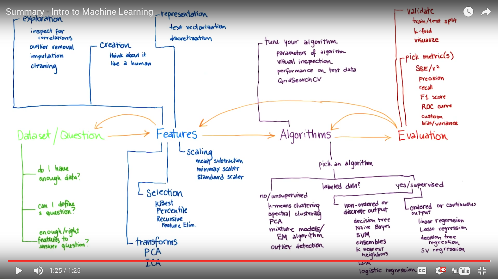

[如何成为一名合格的数据分析师？](README.md)

# 学习资料库

## 目录
- [Machine Learning](#machine learning)
  - [Concept Map](#concept map)
  - [Dataset/question](#dataset/question)
  - [Feature Selection](#feature selection)
  - [Algorithm](#algorithm)
  - [Evaluation](#evaluation)

### Machine Learning
#### Concept Map

#### Dataset/question
#### Feature Selection
#### Algorithm
#### Evaluation
   - [准确率(Accuracy), 精确率(Precision), 召回率(Recall)和F1-Measure](https://argcv.com/articles/1036.c)
