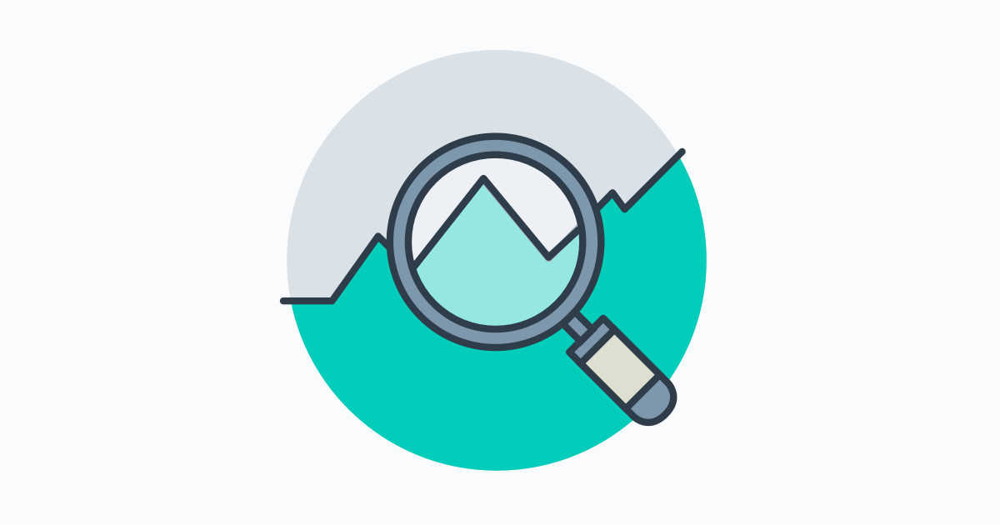

# How to become a data analyst？

## What is it？
This is my study plan for going from no tech background to data analyst.

## Table of Contents
- [What is it？](#what-is-it)
- [The plan](#the plan)
- [The daily log](dailylog.md)
- [My library](library.md)
- [Current Skill](#current-skill)
- [Reference](#reference)

## The Plan

### Online Course
  - [x] Udacity CS101 —— [Intro to Computer Science](https://www.udacity.com/course/intro-to-computer-science--cs101)
  - [ ] Udacity Data Analyst Nanodegree —— [Data Analyst Nanodegree](https://www.udacity.com/course/data-analyst-nanodegree--nd002)

### Reading list
  - [ ] Python for Data Analysis
  - [ ] R for Beginners

### learning language
  - [ ]Python
    - [ ] Improve python skills by [CodeFights](https://codefights.com/)
    - [ ] Web Crawling

### Build my own learning library
  - [ ] keep adding materials, notes, books there
  - [x] Translate current readme.me to English version

## Current Skill
> Beginner/Intermediate/Expert

- Python【Intermediate】
- SQL【Intermediate】
- R【Intermediate】
- JavaScript【Intermediate】
- Statistic【Intermediate】
- EXCEL【Intermediate】
- Machine Learning【Beginner】

## Reference

- [数据分析入门及职业规划？](https://www.zhihu.com/question/28945531)
