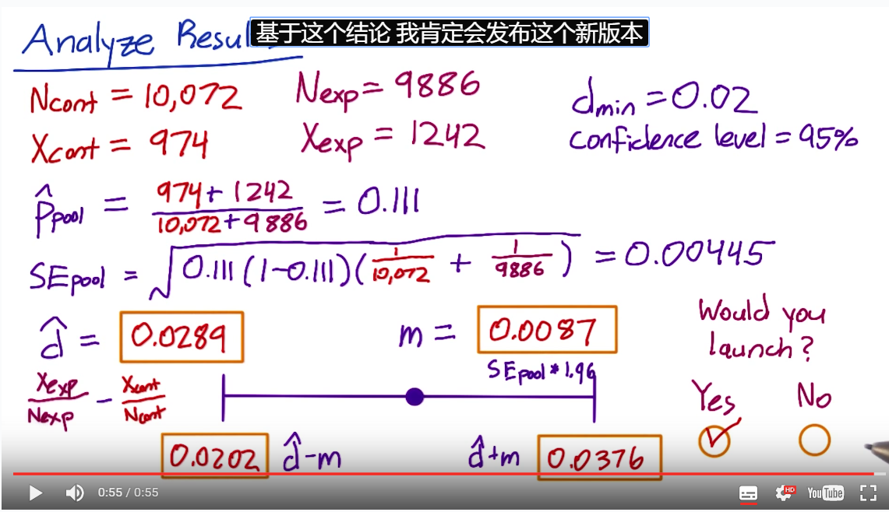

# Library
This is the library where I put all of my learning materials and notes.

## Content
- [Linear Algebra](#linear-algebra)
- [Statistic](#statistic)
- [Python](#python)
  - [Basic](#basic)
  - [Numpy](#numpy)
  - [Pandas](#pandas)
- [Machine Learning](#machine-learning)
  - [Concept Map](#concept-map)
  - [Dataset/question](#dataset-question)
  - [Feature Selection](#feature-selection)
  - [Algorithm](#algorithm)
  - [Evaluation](#evaluation)
- [Data Visualization](#data-visualization)
- [Others](#others)

## Linear Algebra
 - [Vector](Linear%20Algebra/vector.py)

## Statistic
 - [Basic concepts(pdf version)](https://github.com/clarkyu2016/Become-a-Data-Analyst/tree/master/library/statistic)
 - [Binomial distribution](https://en.wikipedia.org/wiki/Binomial_distribution)

## Python
 - ["yield"](http://www.ibm.com/developerworks/cn/opensource/os-cn-python-yield/)

### Basic
  - [How to import packages or open files from subdirectory?](python/importrelative.md)
  - [ Using % and .format() for great good!](https://pyformat.info/)

### Numpy

### Pandas

## Machine Learning

### Concept Map

### Dataset Question

### Feature Selection

### Algorithm
   - [Top 10 Machine Learning Algorithms](https://www.dezyre.com/article/top-10-machine-learning-algorithms/202)

   - [机器学习算法一览](http://it.sohu.com/20160112/n434311372.shtml)

### Evaluation
   - [准确率(Accuracy), 精确率(Precision), 召回率(Recall)和F1-Measure](https://argcv.com/articles/1036.c)

## Data Visualization
 - [Graphical perception – learn the fundamentals first](http://flowingdata.com/2010/03/20/graphical-perception-learn-the-fundamentals-first/)
 - [Visual Encoding](https://www.targetprocess.com/articles/visual-encoding/)
 - [A Tour through the Visualization Zoo](http://queue.acm.org/detail.cfm?id=1805128)
 - [The functional art](http://www.thefunctionalart.com/)
 - [Storytelling with data](http://www.storytellingwithdata.com/)
 - [D3 Tutorials](http://alignedleft.com/tutorials/d3)
 - [Rules for using color](http://www.perceptualedge.com/articles/visual_business_intelligence/rules_for_using_color.pdf)
 - [Cartastrophe Chart](https://cartastrophe.wordpress.com/)
 - [A Layered Grammar of Graphics](http://byrneslab.net/classes/biol607/readings/wickham_layered-grammar.pdf)
 - [Introducing the Grammar of Graphics Plotting Concept](http://www.science-craft.com/2014/07/08/introducing-the-grammar-of-graphics-plotting-concept/)
 - [Clarity or Aesthetics? Part 2 – A Tale of Four Quadrants](http://dataremixed.com/2012/05/clarity-or-aesthetics-part-2-a-tale-of-four-quadrants/)
 - [Clarity or Aesthetics? Part 3 – Tips for Achieving Both](http://dataremixed.com/2012/06/clarity-or-aesthetics-part-3-tips-for-achieving-both/)
 - [https://visualisingadvocacy.org/blog/disinformation-visualization-how-lie-datavis](https://visualisingadvocacy.org/blog/disinformation-visualization-how-lie-datavis)
 - [https://bost.ocks.org/mike/selection/](https://bost.ocks.org/mike/selection/)
 - D3
   - [animations and transitions](http://www.jeromecukier.net/blog/2012/07/16/animations-and-transitions/)
   - [Learning D3 Part 3: Animation & Interaction](http://synthesis.sbecker.net/articles/2012/07/10/learning-d3-part-3-animation-interaction)
   - [Let’s Make a Bubble Map](https://bost.ocks.org/mike/bubble-map/)
 - Tools
   - [ColorBrewer](http://colorbrewer2.org/)
   - [Adobe's Color CC](https://color.adobe.com/create/color-wheel)
   - [Chart Chooser](http://labs.juiceanalytics.com/chartchooser/index.html)

## Others
### A/B Testing

 - Rates are better for usability testing.
